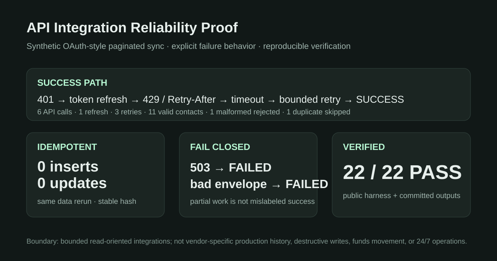

# API Integration Reliability Demo

> **Synthetic / internal proof — not a client case and not vendor-specific production history.**

A compact buyer-facing proof for a common integration responsibility:

**paginated SaaS/API sync → validation → bounded retry / rate-limit handling → idempotent storage → explicit failure state → verification**



## Result

The demo runs a synthetic OAuth-style CRM sync with deliberate faults:

- page 2 first returns **401** → access token refresh;
- page 2 then returns **429** → `Retry-After` is respected;
- page 3 first times out → bounded retry succeeds;
- one malformed contact is quarantined;
- one cross-page duplicate is skipped;
- **11** valid contacts are stored;
- the same dataset rerun creates **0** duplicates or updates;
- a permanent **503** ends as `FAILED` after the retry budget;
- a malformed response envelope also ends as `FAILED`;
- a client-style V2 rule change is applied and remains idempotent on rerun;
- automated acceptance: **22/22 PASS**.

## Inspect it in under one minute

1. Fault plan and fixtures: [samples/scenario.json](samples/scenario.json)
2. Checked execution evidence: [outputs/evidence.json](outputs/evidence.json)
3. Final synchronized rows: [outputs/final_contacts.csv](outputs/final_contacts.csv)
4. Acceptance evidence: [ACCEPTANCE.md](ACCEPTANCE.md)

## What this proves

This proof supports bounded responsibility for:

- read-oriented REST/API integrations;
- response/data validation and explicit malformed-data handling;
- OAuth-style access-token refresh mechanics;
- paginated sync;
- rate-limit handling using server-provided retry guidance;
- bounded retries for temporary failures;
- external-ID upsert and same-run de-duplication;
- idempotent reruns;
- explicit partial-failure status instead of silent success;
- regression after an agreed business-rule change;
- reproducible verification and handoff evidence.

## What it does **not** prove

This demo does not claim:

- production expertise with any named SaaS vendor;
- access to or experience with a buyer's tenant/account;
- production secret storage or token-rotation ownership;
- destructive write/delete integration;
- payment or funds movement;
- high-volume webhook/event infrastructure;
- 24/7 connector operations or on-call responsibility;
- a real stranger-client engagement.

Real integration work still requires the vendor's official OAuth, rate-limit, pagination, webhook, permission and data-retention rules to be checked against the actual account and acceptance criteria.

## Reproduce

Python 3, standard library only.

```bash
python src/run_demo.py
python tests/verify_outputs.py
```

Expected final line:

```text
22/22 acceptance checks PASS
```

## Responsibility this supports

A suitable first paid slice is:

> Given documented API access, a bounded read-oriented object sync, agreed field mapping and objective acceptance criteria, implement and verify pagination, validation, retry/rate-limit behavior, idempotent persistence, explicit error handling and a handoff package.

Before accepting a real project, vendor-specific scopes, token lifecycle, quotas, sandbox/production endpoints, destructive side effects and data-handling requirements must be confirmed.
